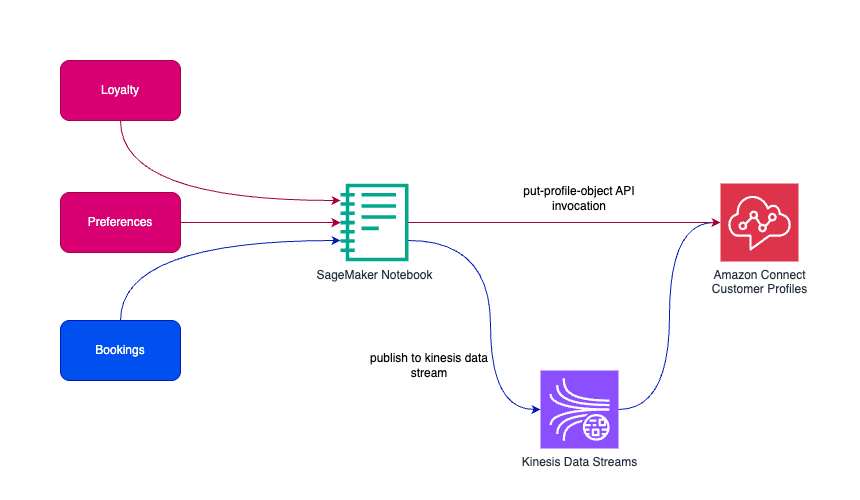
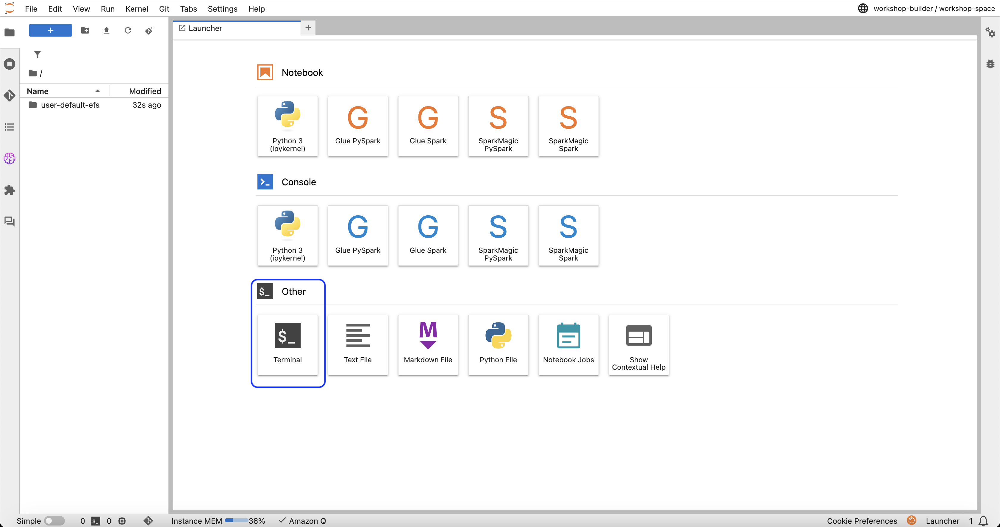
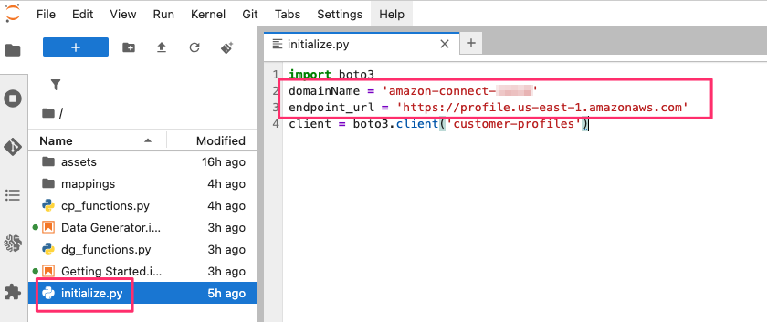
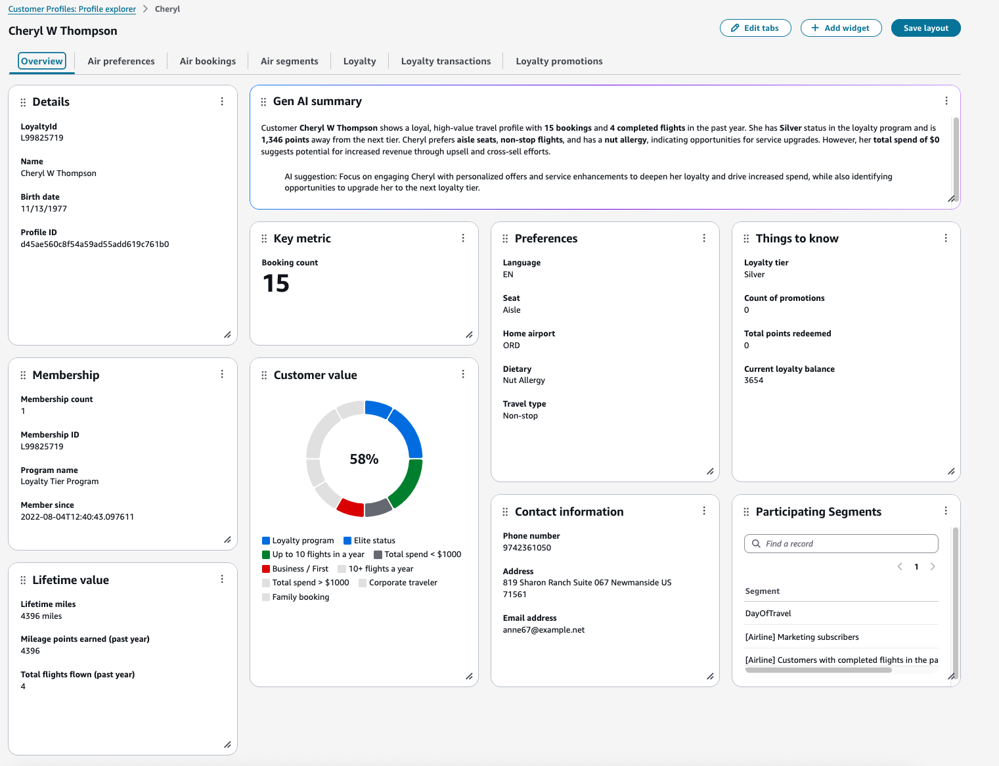

# Amazon Connect Customer Profiles for Travel and Hospitality  [](https://github.com/dwyl/esta/issues)

## Overview

The goal of this project is to provide a starting point for Travel and Hospitality companies to set up and configure Amazon Connect Customer Profiles (ACCP) to manage customer profiles for their industry. ACCP is a customer data unification and profile management service that makes it easy to build customer 360 applications.

This repository includes scripts for **airlines**, and **hotels** specific templates of ACCP. For each template, the repository includes:

- **Object Type Mappings**: These are located in the `mappings/` folder. They contain the definitions for common customer-related object types (e.g. Loyalty, Booking, Preferences) and their associated attributes relevant for the Travel and Hospitality industry.

- **Calculated Attributes**: These are located in the `mappings/` folder for **airlines**. They are examples of derived/calculated attributes that can be configured within the ACCP domain, such as "TotalDollarsSpentInAYear" or "DayOfTravel".

- **Notebooks**: The repository contains notebooks to load the object type mappings and create the calculated attributes within the ACCP Domain. Additionally, the data generator notebook generates sample data that conforms to the provided object type mappings and builds the profiles in ACCP. This notebook can be used for testing and demonstration purposes.

- **Scripts**: These are helper python functions that load the mapping definition and communicate with ACCP via boto3 sdk.

## Prerequisites

Before starting, ensure you have:

1. An AWS account with appropriate permissions
1. Access to Amazon Connect
2. Customer Profiles enabled as an application within Amazon Connect
1. Access to Amazon SageMaker notebook instances with internet access
1. Required Python libraries (automatically installed in notebooks with pip install commands)

## High Level flow

This sample code repository demonstrates interaction with ACCP via an API and real-time streaming using Kinesis. The Loyalty and Preferences objects are sent to the ACCP domain via Customer Profiles SDK. The Booking objects are published to a Kinesis data stream, and ACCP has a data integration with Kinesis to read the objects are they arrive on the data stream.



## Getting started

To use the assets in this repository, you will need an active ACCP domain in your AWS account. Refer to the [ACCP documentation](https://docs.aws.amazon.com/customerprofiles/latest/APIReference/Welcome.html) for instructions on setting up a domain.

Once you have an ACCP domain, you can:

1. Import the Jupyter notebooks, python files and other assets in Sagemaker Notebook <br />
	 a. In JupyterLab, select "Terminal" to open a new terminal window <br /> 
	 b. In the terminal, execute the following command to clone the repository <br />
	 ```
	 git clone https://github.com/aws-samples/sample-for-customer-profiles-travel-hospitality.git
	 ```
	 
	
			
2. Once the cloning completes, navigate to the `initialize.py` file:<br />
	a. Replace the ACCP domain <br />
	b. Update the endpoint URL with the correct AWS region
	
	

3. Launch the `Getting Started.ipynb` notebook and execute the cells as directed. This will created `Loyalty`, `Booking`, and `Preferences` object type mappings. It will also create two calculated attributes, `TotalDollarsSpentInAYear` and `DayOfTravel`. <br />
	`TotalDollarsSpentInAYear` - It is a `SUM` of the total price of all airline bookings from a year until now <br />
	`DayOfTravel` - It counts the number of flights for every profile, based on the flight's departure date and time. This can be used later in a segmentation to identify all passengers that are traveling in the next 24 hours to support any operational use-cases, hence the name `DayOfTravel`.

4. Launch the `Data Generator.ipynb` notebook to generate sample load for each of the mappings.

5. Login into the ACCP application and navigate to **Profile Explorer** under the Customer Profiles menu option. Click on any of the profile listed within the Recent Profiles. A Profile view of the customer is launched with all the different objects populated based on the data generator script executed in the previous step.

	


## Security

See [CONTRIBUTING](CONTRIBUTING.md#security-issue-notifications) for more information.

## License

This library is licensed under the MIT-0 License. See the LICENSE file.
